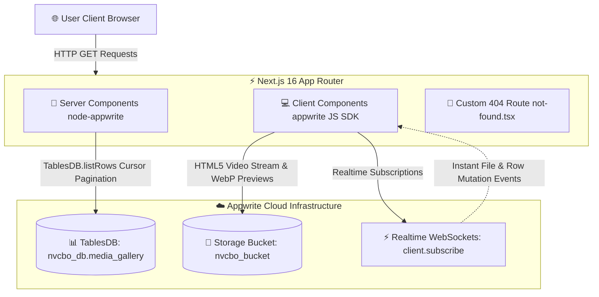

# Northern Vision CBO (NVCBO) Landing Page

This is the official platform for **Northern Vision Community-Based Organization (NVCBO)**, a grassroots-led initiative working with indigenous and pastoralist communities in Northern Kenya to strengthen climate resilience, gender justice, education, and community wellbeing.

---

## 🏗️ System Architecture & Data Flow



## 🗺️ Visual Website Sitemap

```mermaid
flowchart TD
    Home["🏠 Homepage /"] --> About["ℹ️ About Us /about"]
    Home --> Healing["💬 Healing Circles /healing-circles"]
    Home --> Impact["🌱 Our Impact /our-impact"]
    Home --> Resources["📚 Resources & Learning /resources"]
    Home --> MediaHub["🖼️ Media Gallery /media-gallery"]

    Healing --> HC_Dialogues["🗣️ Community Dialogues /healing-circles/community-dialogues"]
    Healing --> HC_Keepers["👥 Circle Keeper Training /healing-circles/circle-keepers"]
    Healing --> HC_Indigenous["📜 Indigenous Knowledge /healing-circles/indigenous-knowledge"]

    Impact --> Imp_Climate["☀️ Climate Resilience /our-impact/climate-resilience"]
    Impact --> Imp_Gender["⚖️ Gender & Inclusion /our-impact/gender-equality"]
    Impact --> Imp_Peace["🕊️ Peace & Security /our-impact/peace-security"]
    Impact --> Imp_Edu["🎓 Education & Youth /our-impact/education-youth"]
    Impact --> Imp_Gotu["🌾 Gotu Gamachu Farm /our-impact/gotu-farm"]
    Impact --> Imp_EcoTour["🏕️ Eco-Tourism Hub /our-impact/eco-tourism"]
    Impact --> Imp_HolidayCamp["💻 Digital Literacy Camp /our-impact/holiday-camp"]
    Impact --> Imp_IK["📜 Indigenous Knowledge /our-impact/indigenous-knowledge"]

    Home -. "Shop / Become a Partner / Contact" .-> Dev404["🚧 Under Active Development Custom 404"]
```



---

## 📂 Project Directory Structure

```
publicsite/
├── docs/                                 # Detailed Documentation Manuals
│   ├── NON_TECHNICAL_MANUAL.md           # Visual Sitemaps, User Journeys & Wireframes
│   └── TECHNICAL_ARCHITECTURE.md         # Blueprint & Architecture Specification
├── src/
│   ├── app/
│   │   ├── about/                        # Our Story, Beliefs, Partners, 2025 Review
│   │   ├── api/                          # Serverless API Endpoints (gallery-images)
│   │   ├── components/                   # Reusable UI Components
│   │   │   ├── CircleGalleryModal.tsx    # Lightbox Modal (Top-Right Close, Esc/Arrow key nav)
│   │   │   ├── Footer.tsx                # Site Footer
│   │   │   └── Header.tsx                # Glass Sticky Navbar & Mobile Drawer
│   │   ├── healing-circles/              # Healing Circles & Sub-tracks
│   │   │   ├── circle-keepers/           # Circle Keeper Training & Photo Gallery
│   │   │   ├── community-dialogues/      # Community Dialogues & Photo Gallery
│   │   │   └── indigenous-knowledge/     # Indigenous Knowledge Integration
│   │   ├── media-gallery/                # Dynamic Media Hub (TablesDB + Realtime WS)
│   │   │   ├── MediaGalleryClient.tsx    # Native MP4 Video Player & Content-Hugging Pills
│   │   │   └── page.tsx                  # Server Component (TablesDB Recursive Fetch)
│   │   ├── our-impact/                   # Impact Tracks (Climate, Gender, Peace, Eco-Tourism, etc.)
│   │   ├── resources/                    # Resources & Learning Hub
│   │   ├── shop/                         # Shop Redirect / Under Development 404 Handler
│   │   ├── globals.css                   # Tailwind CSS Theme & Animated Brand Gradients
│   │   ├── layout.tsx                    # Root Layout
│   │   ├── not-found.tsx                 # Custom Dark-Mode 404 Page & Newsletter Form
│   │   └── page.tsx                      # Homepage (Animated Hero Title, Programs Grid, Methodology)
├── .env                                  # Environment Variables (Gitignored)
├── AGENTS.md                             # AI Agent Rules & Security Directives
├── README.md                             # Repository Overview
└── SECURITY.md                           # Security Vulnerability & Secret Handling Directives
```

---

## 🚀 Tech Stack

- **Framework**: [Next.js 16](https://nextjs.org/) (App Router)
- **Styling**: Vanilla CSS with Tailwind CSS utilities & dynamic animations
- **Icons**: [Lucide React](https://lucide.dev/)
- **Backend / Database**: [Appwrite Cloud](https://appwrite.io) (`TablesDB` API)
- **Storage CDN**: Appwrite Storage Buckets (`nvcbo_bucket`)
- **Realtime Synchronization**: Appwrite Client SDK (`client.subscribe`)

---

## ✨ Key Platform Features & Recent Updates

1. **Animated Hero Gradient Title**:
   - The homepage hero title (`Community Transformation Begins with Healing`) features a smooth, animated text color shift across brand colors (White, Gold `#F39C12`, Yellow `#F1C40F`, Rust `#D35400`).

2. **Native HTML5 MP4 Lightbox Video Player**:
   - Native `<video controls autoPlay playsInline>` streaming in `/media-gallery` with volume adjustment, full scrubbing support, and dynamic WebP preview fallbacks.

3. **Content-Hugging Category Pills**:
   - Media Gallery categories wrap naturally and hug button text on mobile screens (`w-auto`), allowing multiple filter pills per line.

4. **Refined Image Lightbox Modals**:
   - `CircleGalleryModal` features a close button (`X`) positioned outside the image frame in the top-right corner with generous margins, plus keyboard listeners (`Esc` to exit, `ArrowLeft`/`ArrowRight` to cycle photos).

5. **Custom Dark-Mode 404 Page with Newsletter Form**:
   - Includes a custom **Under Active Development** message on `/shop`, `/contact`, and `/become-a-partner`, backed by a client-side Newsletter Subscription Form.

6. **Realtime TablesDB Integration**:
   - Synchronizes media uploads and deletions live across clients using Appwrite WebSockets without page refreshes.

---

## 🛠️ Local Development

1. Copy `.env.example` to `.env`:
   ```bash
   NEXT_PUBLIC_APPWRITE_ENDPOINT=https://cloud.appwrite.io/v1
   NEXT_PUBLIC_APPWRITE_PROJECT_ID=your_project_id
   NEXT_PUBLIC_APPWRITE_DATABASE_ID=nvcbo_db
   NEXT_PUBLIC_APPWRITE_BUCKET_ID=nvcbo_bucket
   APPWRITE_API_KEY=your_secret_api_key  # Server-side scripts only! Never expose to client.
   ```

2. Run the development server:
   ```bash
   npm install
   npm run dev
   ```

3. Open [http://localhost:3000](http://localhost:3000) with your browser.

---

## 🌐 Deployment & Environment Configuration

### Appwrite Site SSR Git Deployment
This project is continuously deployed using **Appwrite Site's SSR Git Deployment** pipeline. When code is pushed to `master`, Appwrite automatically builds and deploys serverless compute for Next.js 16.

### Environment Variables & Custom Domain Setup
- Ensure `NEXT_PUBLIC_APPWRITE_ENDPOINT`, `NEXT_PUBLIC_APPWRITE_PROJECT_ID`, `NEXT_PUBLIC_APPWRITE_DATABASE_ID`, and `NEXT_PUBLIC_APPWRITE_BUCKET_ID` are configured in Appwrite Console settings.
- **Custom Domain**: Update `NEXT_PUBLIC_APPWRITE_ENDPOINT` to your custom domain (e.g., `https://<YOUR_CUSTOM_DOMAIN>/v1`). Appwrite automatically manages SSL certificates and first-party cookies.

*(Do NOT commit your `APPWRITE_API_KEY` into Git. Refer to [SECURITY.md](SECURITY.md) for security procedures.)*

---

## 📖 Additional Manuals & Reference Guides

- 📘 [Non-Technical Platform Guide](docs/NON_TECHNICAL_MANUAL.md) — Visual sitemap, user journeys & wireframe layouts.
- 💻 [Technical Architecture Blueprint](docs/TECHNICAL_ARCHITECTURE.md) — Deep technical documentation, schema & API flowcharts.
- 🔒 [Security Policy](SECURITY.md) — Environment variable protection & secret handling guidelines.
