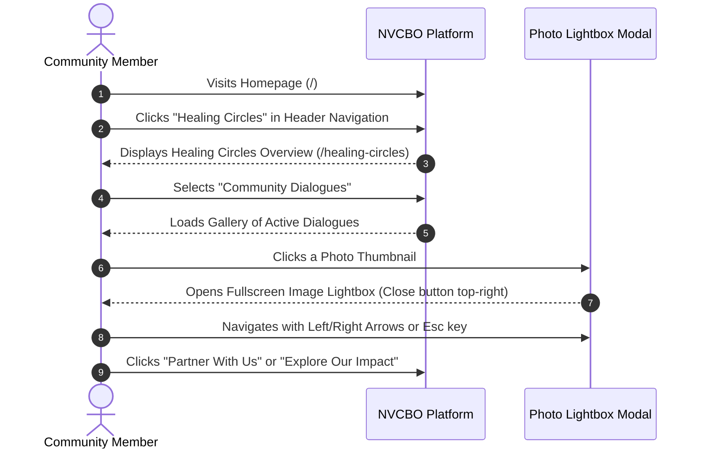
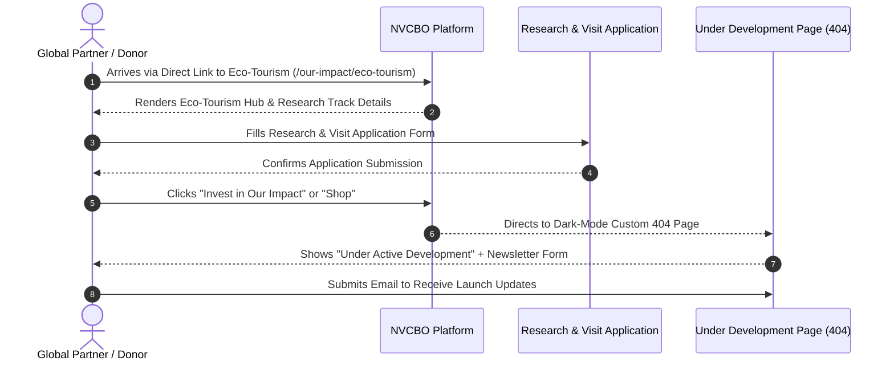

# Northern Vision CBO — Non-Technical Platform Guide & User Manual

Welcome to the official user guide for the **Northern Vision Community-Based Organization (NVCBO)** digital platform. This document provides clear, visual explanations of how our platform is structured, how visitors navigate our site, and how community members and partners interact with our features.

---

## 1. Visual Website Sitemap

Below is the complete interactive visual sitemap showing all pages currently published on our website:

```mermaid
flowchart TD
    Home["🏠 Homepage (/)"] --> About["ℹ️ About Us (/about)"]
    Home --> Healing["💬 Healing Circles (/healing-circles)"]
    Home --> Impact["🌱 Our Impact (/our-impact)"]
    Home --> Resources["📚 Resources & Learning (/resources)"]
    Home --> MediaHub["🖼️ Media Gallery (/media-gallery)"]
    Home --> Shop404["🛍️ Shop (/shop -> 404)"]

    %% Healing Circles Sub-pages
    Healing --> HC_Dialogues["🗣️ Community Dialogues (/healing-circles/community-dialogues)"]
    Healing --> HC_Keepers["👥 Circle Keeper Training (/healing-circles/circle-keepers)"]
    Healing --> HC_Indigenous["📜 Indigenous Knowledge (/healing-circles/indigenous-knowledge)"]

    %% Our Impact Sub-pages
    Impact --> Imp_Climate["☀️ Climate Resilience (/our-impact/climate-resilience)"]
    Impact --> Imp_Gender["⚖️ Gender & Social Inclusion (/our-impact/gender-equality)"]
    Impact --> Imp_Peace["🕊️ Peace & Security (/our-impact/peace-security)"]
    Impact --> Imp_Edu["🎓 Education & Youth (/our-impact/education-youth)"]
    Impact --> Imp_Gotu["🌾 Gotu Gamachu Farm (/our-impact/gotu-farm)"]
    Impact --> Imp_EcoTour["🏕️ Eco-Tourism Hub (/our-impact/eco-tourism)"]
    Impact --> Imp_HolidayCamp["💻 Digital Literacy Camp (/our-impact/holiday-camp)"]
    Impact --> Imp_IK["📜 Indigenous Knowledge (/our-impact/indigenous-knowledge)"]

    %% Custom Under Development 404 Routes
    Shop404 -.-> Dev404["🚧 Under Active Development (Custom 404)"]
    Home -. "Become a Partner" .-> Dev404
    Home -. "Contact" .-> Dev404
```



---

## 2. User Journeys (Visual Flowcharts)

### Journey A: Community Member Exploring Healing Circles


---

### Journey B: Partner & Donor Discovering Impact & Eco-Tourism


---

## 3. Wireframes & Layout Structures

### Homepage Wireframe Layout
```
+-----------------------------------------------------------------------------------+
|                        STICKY GLASS NAVBAR (Header)                                |
|  [Logo] NVCBO   Home | Healing Circles v | About Us v | Our Impact v | Resources v|
|                 [Shop (New)]  [Contact]  (Mobile Hamburger Menu)                  |
+-----------------------------------------------------------------------------------+
| HERO SECTION                                                                      |
| "Community Transformation Begins with Healing" (Animated Brand Color Gradient)   |
| [Experience Healing Circles]                         [Explore Areas of Impact]    |
+-----------------------------------------------------------------------------------+
| CORE PROGRAMS GRID (4 Columns on Desktop / Compact Inline Headers)               |
| [Healing Circles]   [Climate Adaptation]   [Gender Justice]   [Education & Youth] |
+-----------------------------------------------------------------------------------+
| OUR METHODOLOGY (3 Glassmorphism Dark Espresso Cards)                              |
| [Explore Healing Circles]     [Circle Keeper Training]     [Community Dialogues]  |
+-----------------------------------------------------------------------------------+
| FOOTER (Links, Contact Details, Social Channels, Copyright)                       |
+-----------------------------------------------------------------------------------+
```

### Media Gallery Wireframe Layout
```
+-----------------------------------------------------------------------------------+
| HERO SECTION: "Media Gallery — Our Journey in Frames and Stories"                |
+-----------------------------------------------------------------------------------+
| CATEGORY FILTER BAR (Content-Hugging Wrapping Pills)                             |
| (All Media) (Gotu Farm) (Biolit Camp) (Bruns in Kenya) (Sweden) (Wolfram STEM)   |
+-----------------------------------------------------------------------------------+
| ASYMMETRICAL BENTO GRID                                                           |
| +-------------------------+ +-------------------------+ +-----------------------+ |
| | [Video Frame Thumbnail] | | [Photo Image]           | | [Photo Image]         | |
| | ▶ Play Icon Overlay    | | Category Tag            | | Category Tag          | |
| | Title & Caption         | | Title & Caption         | | Title & Caption       | |
| +-------------------------+ +-------------------------+ +-----------------------+ |
+-----------------------------------------------------------------------------------+
| LIGHTBOX MODAL (Triggered on Click)                                              |
| [X] Close (Top Right, Outside Image Frame)                                        |
| [ Native HTML5 <video controls autoPlay> OR High-Res Photo ]                     |
| Title, Category & Full Caption Description Bar                                   |
+-----------------------------------------------------------------------------------+
```

---

## 4. Feature Summary & How to Use

| Feature | Location | Description |
| :--- | :--- | :--- |
| **Animated Title Gradient** | Homepage Hero | Text colors shift smoothly between White, Brand Gold (`#F39C12`), Vibrant Yellow (`#F1C40F`), and Brand Rust (`#D35400`). |
| **Interactive Gallery Lightbox** | Resources & Healing Circles | Displays up to 6 images with fullscreen view. Includes `Esc` key exit and top-right close button positioned outside the image frame. |
| **Realtime Media Gallery** | `/media-gallery` | Plays native HTML5 MP4 videos with volume controls, scrubbing, and category filtering (Gotu Farm, Sweden, Wolfram, etc.). |
| **Custom 404 Under Development** | `/shop`, `/contact`, `/become-a-partner` | Premium Dark Espresso theme informing visitors that the section is under active development, featuring an interactive Newsletter Subscription Form. |
