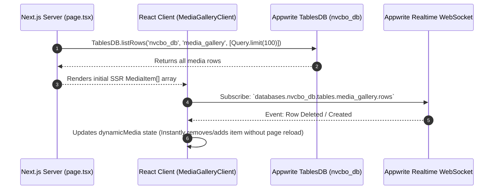

# Northern Vision CBO — Technical Architecture & Developer Reference

This document provides a comprehensive technical blueprint of the **Northern Vision Community-Based Organization (NVCBO)** web application codebase.

---

## 1. System Architecture Overview

The platform is engineered as a modern, high-performance web application built with **Next.js 16 (App Router)** and backed by **Appwrite Cloud (TablesDB & Storage)**.

```mermaid
graph TD
    UserClient["🌐 Web Browser (Client)"]
    
    subgraph NextJS["⚡ Next.js 16 App Router (SSR & CSR)"]
        PageServer["📄 Server Components (node-appwrite)"]
        ClientComponents["💻 Client Components (appwrite JS SDK)"]
        Custom404["🚧 not-found.tsx (Custom 404 Route)"]
    end

    subgraph AppwriteCloud["☁️ Appwrite Cloud Infrastructure"]
        TablesDB[("📊 TablesDB (nvcbo_db.media_gallery)")]
        StorageCDN[("📁 Storage Bucket (nvcbo_bucket)")]
        RealtimeWS["⚡ Realtime WebSockets (client.subscribe)"]
    end

    UserClient -->|HTTP GET Requests| NextJS
    PageServer -->|Server-Side Fetch (listRows)| TablesDB
    ClientComponents -->|WebSocket Connection| RealtimeWS
    ClientComponents -->|HTML5 Video Stream & WebP Previews| StorageCDN
    RealtimeWS -.->|Realtime Row/File Mutations| ClientComponents
```

---

## 2. Route Directory & Dynamic Page Map

| Route Path | Type | Dynamic Data Provider | Key Components |
| :--- | :--- | :--- | :--- |
| `/` | Static (Prerendered) | Static Narrative Copy | Hero (Animated Gradient Title), 4-Col Program Cards, Methodology Glass Cards |
| `/about` | Static | Anchor-linked sections | Story, Beliefs, How We Work, Partners, 2025 Review |
| `/healing-circles` | Static | Static Data | Pillars, Overview, Request Circle Form CTA |
| `/healing-circles/circle-keepers` | Static | Local Gallery Array | `CircleGalleryModal` (6-Image Limit, Top-Right Close Button) |
| `/healing-circles/community-dialogues` | Static | Local Gallery Array | `CircleGalleryModal` (Fullscreen Lightbox) |
| `/healing-circles/indigenous-knowledge` | Static | Static Data | Knowledge preservation frameworks |
| `/our-impact` | Dynamic (SSR) | Appwrite TablesDB | All Impact Tracks Overview & Impact Cards |
| `/our-impact/climate-resilience` | Dynamic (SSR) | TablesDB Rows | Dryland farming & climate adaptation metrics |
| `/our-impact/eco-tourism` | Dynamic (SSR) | TablesDB Rows | Eco-Tourism Hub & `VisitApplicationForm` component |
| `/resources` | Dynamic (SSR) | Appwrite Storage | `ResourcesGallery` (Interactive 6-Image Lightbox) |
| `/media-gallery` | Dynamic (SSR + WS) | Appwrite `TablesDB.listRows` | `MediaGalleryClient` (Category pills wrap on mobile, native `<video>` lightbox player) |
| `/_not-found` (`/shop`, `/contact`, `/become-a-partner`) | Static | Custom `not-found.tsx` | Dark Espresso theme, Under Development status, Newsletter Subscription Form |

---

## 3. Realtime Media Gallery Synchronization Flow



---

## 4. Media Gallery Lightbox & Video Player Logic

### Video vs. Image Rendering Strategy
To prevent Appwrite Storage preview transformation errors (`HTTP 402`) on raw MP4 files from triggering image deletion handlers, video and image rendering are explicitly decoupled:

```typescript
// Grid Card Media Rendering
{item.type === 'video' ? (
  <video
    src={item.videoUrl}
    preload="metadata"
    muted
    playsInline
    className="absolute inset-0 w-full h-full object-cover pointer-events-none"
  />
) : (
   setDynamicMedia(prev => prev.filter(m => m.appwriteId !== item.appwriteId))}
  />
)}
```

### Fullscreen Native Video Player
In the active lightbox modal, MP4 files stream directly with native controls, volume adjustment, and full browser scrubbing support:
```tsx
<video src={lightboxItem.videoUrl} controls autoPlay playsInline className="w-full h-full max-h-[75vh] object-contain" />
```

---

## 5. Security & Custom Domain Configuration

### Security Directives
*   **Environment Variables**: All Appwrite project IDs, endpoint URLs, and bucket IDs are consumed strictly via environment variables (e.g. `process.env.NEXT_PUBLIC_APPWRITE_PROJECT_ID`).
*   **Server-Side Secret API Key**: `APPWRITE_API_KEY` is restricted strictly to server-side dynamic routes and CLI seeding scripts. It is never exposed in client bundles or public repositories.

### Custom Appwrite Endpoint Configuration
When routing API requests through a custom domain endpoint (e.g. `https://<YOUR_CUSTOM_DOMAIN>/v1`):
```env
NEXT_PUBLIC_APPWRITE_ENDPOINT="https://<YOUR_CUSTOM_DOMAIN>/v1"
```
The Appwrite Client SDK automatically routes session cookies as first-party cookies, preventing third-party cookie blocking in modern browsers (Safari ITP / Chrome).
